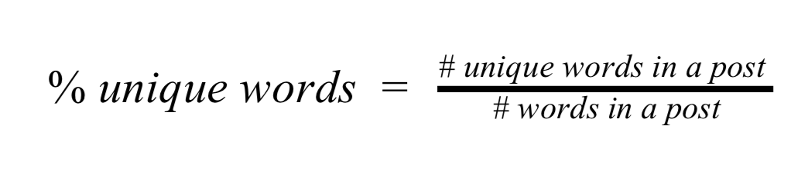
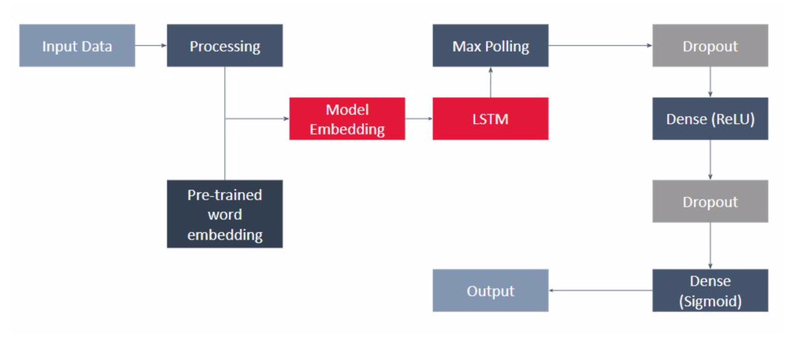

# Traffic Congestion Prediction - Didi Dataset

The repository is to detect the abuse, toxic comments over the internet. The data is from [Kaggle competiotion](https://www.kaggle.com/c/jigsaw-toxic-comment-classification-challenge/kernels).

## Requirements

- `pandas`
- `numpy`
- `keras`
- `TensorFlow`
- `sklearn`
- `praw`

## Notebooks

1.  Run `baseline models.ipynb` to compare the performacen of some baseline models;
2.  Run `data augmentation.ipynb` to create more training data using translation;
3.  Run `Improved LSTM` to train an improved LSTM for better performance;
3.  Run `Getting Data From Reddit` to craw data from Reddit
4.  Run `Extended to Reddit Data` to predict the category for reddit data.

## Solutiin and Results

### Data
The data used to train and validate the model was downloaded from [Kaggle contest Toxic Comment Classification Challenge](https://www.kaggle.com/c/jigsaw-toxic-comment-classification-challenge/kernels), which includes over 100k labeled discussion comments from English Wikipedia. The labelled annotations are based on asking 5000 crowd-workers to rate Wikipedia comments according to their toxicity.

### Data Processing
The data corpus was pre-processed to remove punctuation marks, IP addresses (common in Online Social Platforms), user names and decoded the HTML characters. The resulting corpus was further processed for removal of stopwords, lemmatization, conversion to lowercase characters and creation of word grams/ character grams. However, some common punctuations like !, ? . , were still kept in the model, as they are related to sentence functions or sentence emotions. For example, if a sentence contains a lot of !, the sentence tends to be more angry. Thus, these punctuations were kept and let the model to handle it.

### Baseline Models
Below are the results of different baseline models. Logistic regression, SVM and LSTM outperform the other models in terms of accuracy and F1 score. LSTM obtains the highest score in recall, which is the most relevant to our objective of identifying toxic comments in a social platform setting. With such, we decided to use LSTM as the baseline model, and further improved it with feature engineering and data augmentation.

|             |     LR     |      NB      |       RF     |   XGBoost    |     SVM      |    LSTM      |
|-------------|:----------:|:------------:|:------------:|:------------:|:------------:|:------------:|
| Accuracy    |   0.9746   |    0.9727    |     0.9718   |     0.971    |    0.9718    |    0.9728    |
| Precision   |    0.7     |     0.82     |     0.57     |     0.69     |     0.62     |     0.56     |
| Recall      |    0.58    |     0.36     |     0.62     |     0.46     |     0.67     |     0.70     |
| F1 Score    |    0.63    |     0.48     |     0.58     |     0.54     |     0.64     |     0.62     |

### Furtuer Data Processing
#### Spamming
One of the observations on toxic online comment is spamming. There are quite some circumstances where the same sentence is repeated multiple times. Some of these may not contain malicious words, but still labelled as toxic in the training date set.

This outrageous act of expression contributed partly to the false negative results. Hence, ​% unique words​ is designed to capture such repetition of words.

#### Spelling Error
Another common observation found in social network is spelling error. Intentionally or not, these spelling errors have become quite frequent in an online environment with increasing number of teenagers using slang words and acronyms. A large number of such instances were observed in the dataset. A fuzzy dictionary was lookup approach, based on fastText embedding dictionary to rectify the problem. The approach will exhaustively search for two-step-variations of the misspelled word and look up for the most probable word. This helps to address majority of the misspelling errors in the dataset.

#### Different Language & Special Characters
There are a high number of non-english words in the dataset. To overcome this challenge, Google Cloud NLP API was used to translate texts from foreign languages to English. With such, it is able to train a homogeneous English neural network, and mitigate the impact of unknown words.

### Data Augmentation
Data Augmentation is a process to create more input data points. To train a neural network with lots of parameters, the more data available, the better the model will be. To create more training data, modification to the training data will be usedul. For example, in images, people can rotate the original image, crop the image, flip the image, etc. In this project, translation was used to data augmentation. The idea is, first translate the original comments into another language and then translate back to english, which will create more data points.

### Model Architecture
Below is the final model architecture.

And the improved model results are as follows:
|             |     LR     |     SVM      |  LSTM(base)  | LSTM(improved)|
|-------------|:----------:|:------------:|:------------:|:-------------:|
| Accuracy    |   0.9746   |    0.9718    |    0.9728    |     0.9876    |
| Precision   |    0.7     |     0.62     |     0.56     |      0.57     |
| Recall      |    0.58    |     0.67     |     0.70     |      0.77     |
| F1 Score    |    0.63    |     0.64     |     0.62     |      0.65     |

